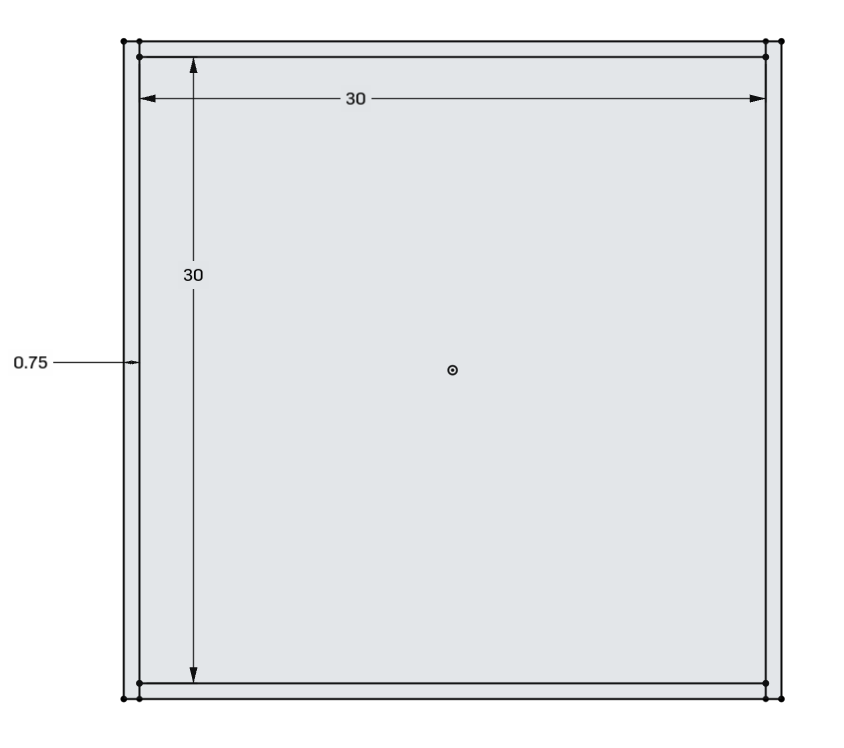
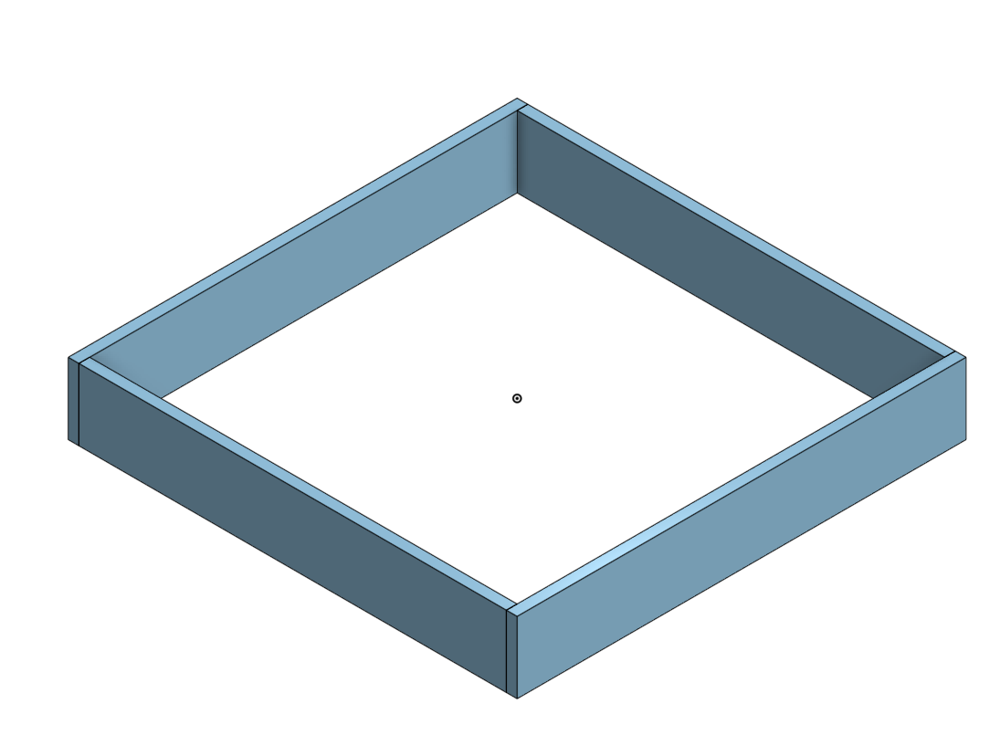
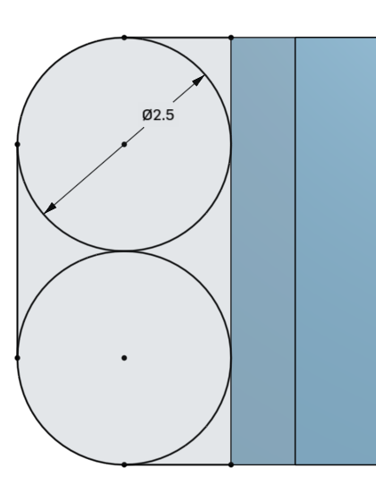
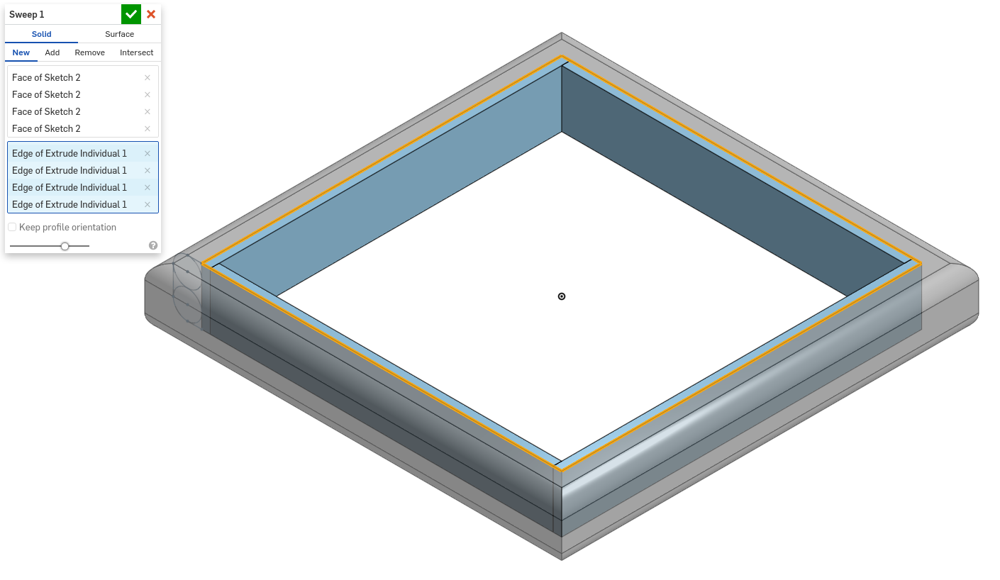
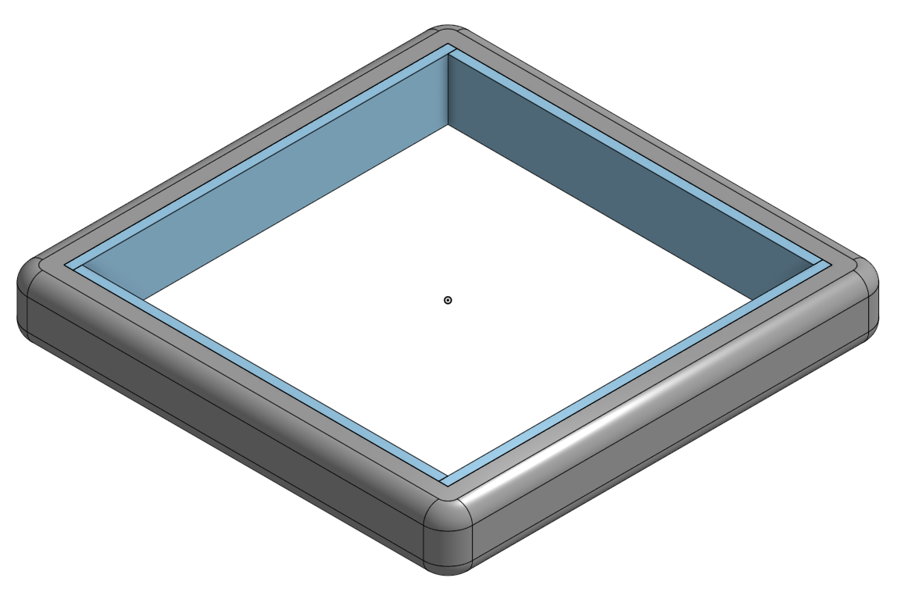

1. Start with a top down sketch for the 3/4" plywood
 
2. Extrude the pieces to 5 inches tall
 
3. Draw a sketch on the end of one of the pieces of plywood with the 2.5" circles for the pool noodles with the outer profile being in the shape of a D.
 
4. Use a sweep command to wrap the bumper profile around the plywood frame.
 
5. Add a fillet at the corners to clean up the look

Here is a link to a quick sample Onshape document: https://cad.onshape.com/documents/079b71c83eb32ec5a484003d/w/a42c7eb338660f04295d5c48/e/acabdbd78d665b27ad36f18c?renderMode=0&uiState=619d47c09256f973adb6fb39