We have been working to organize our toolboxes, and in the process making custom sized organizers for the drawers. Here is a quick guide on how we turn the 3D models into lasercuttable files.

## Design the Box

1. Start with a base sketch. 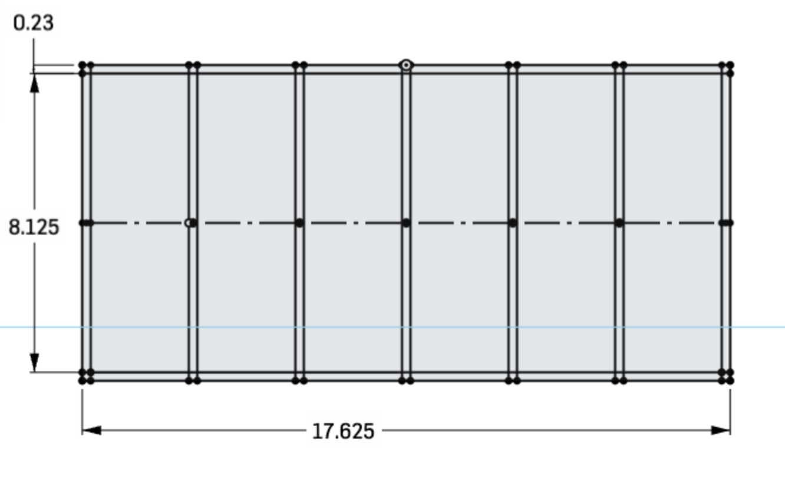
2. Extrude the base and walls to individual parts. Here I used an extrude for the base, all the vertical walls and then the horizontal walls. 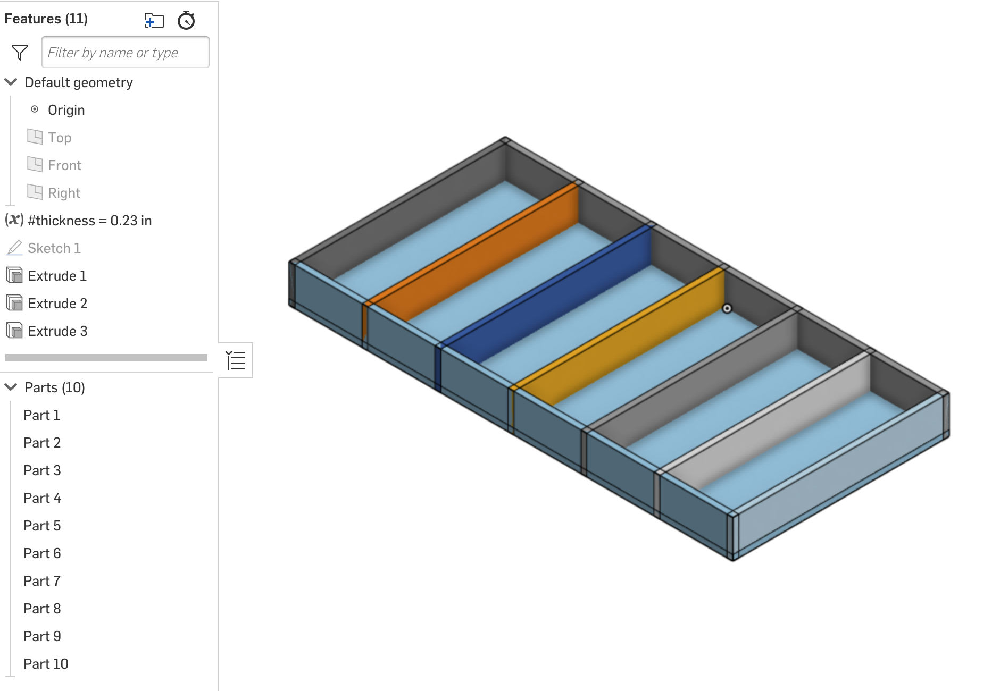

## LaserJoint
3. Use the laser joint tool [(get it here if you don't have it)](/robots/cad/). Select all of your parts, be sure they overlap. 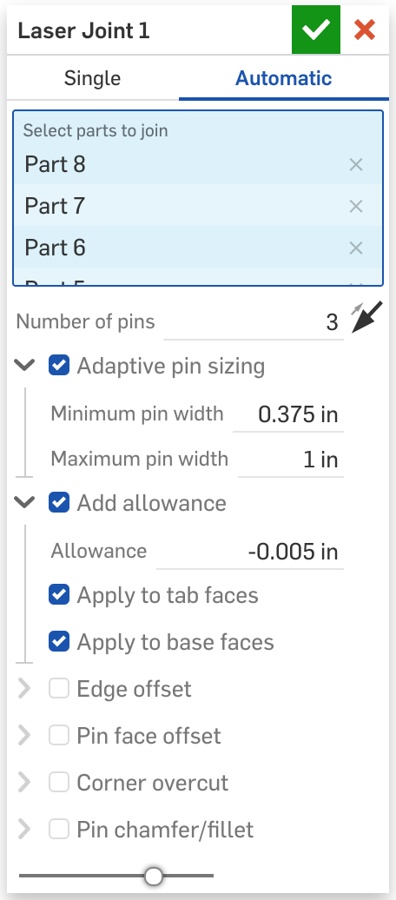
4. Should now have a box that we can laser cut! 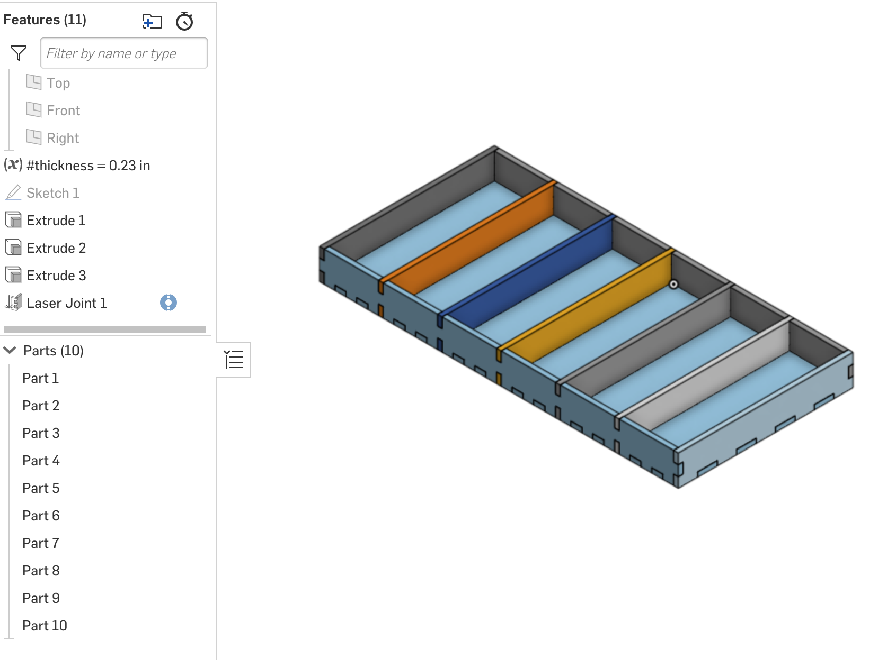

## AutoLayout
5. We can use the AutoLayout featurescript [(get it here if you don't have it)](/robots/cad/) to make a flattened view of our parts. The laser is 24" bu 18". 
6. Now we have our parts nicely laid out, we now need to export this for cutting. 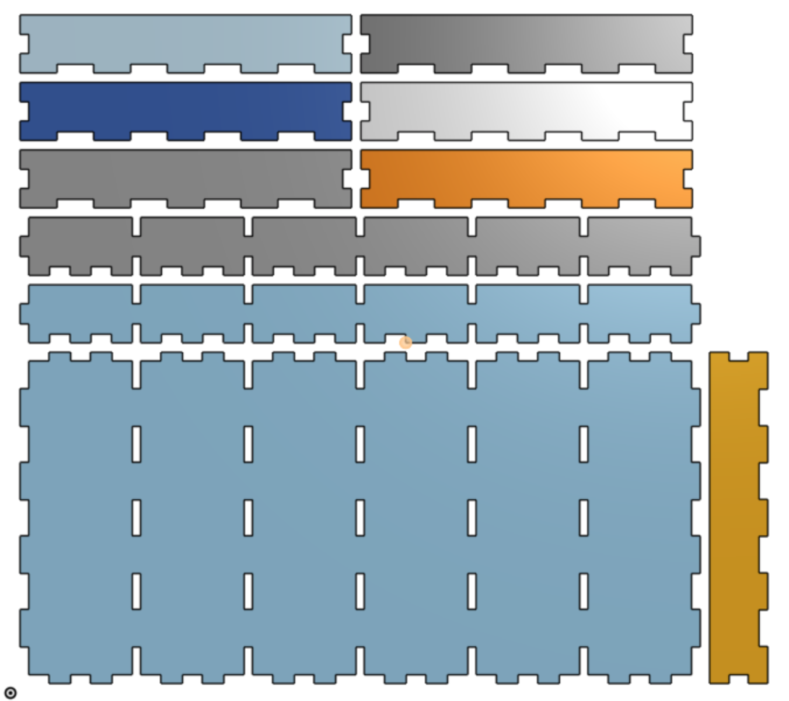

## Export
I've found the best way is to create an assembly and add all the parts to the assembly at the same time to preserve the layout. If you change your design, you will need to re-insert your parts. 

7. Create a new Assembly 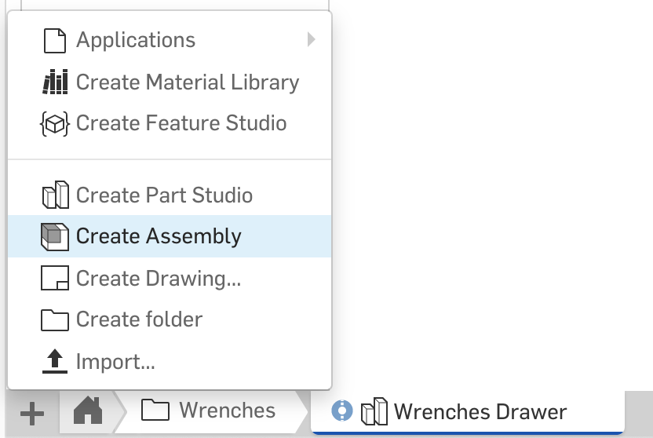
8. Click the insert button 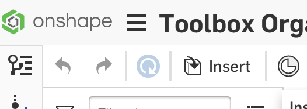
9. Select the entire part studio to insert 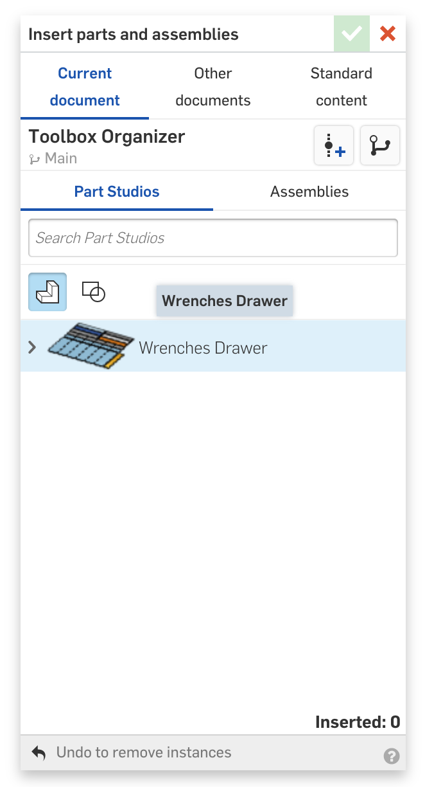
10. Should now have an assembly of all the flat parts to cut. 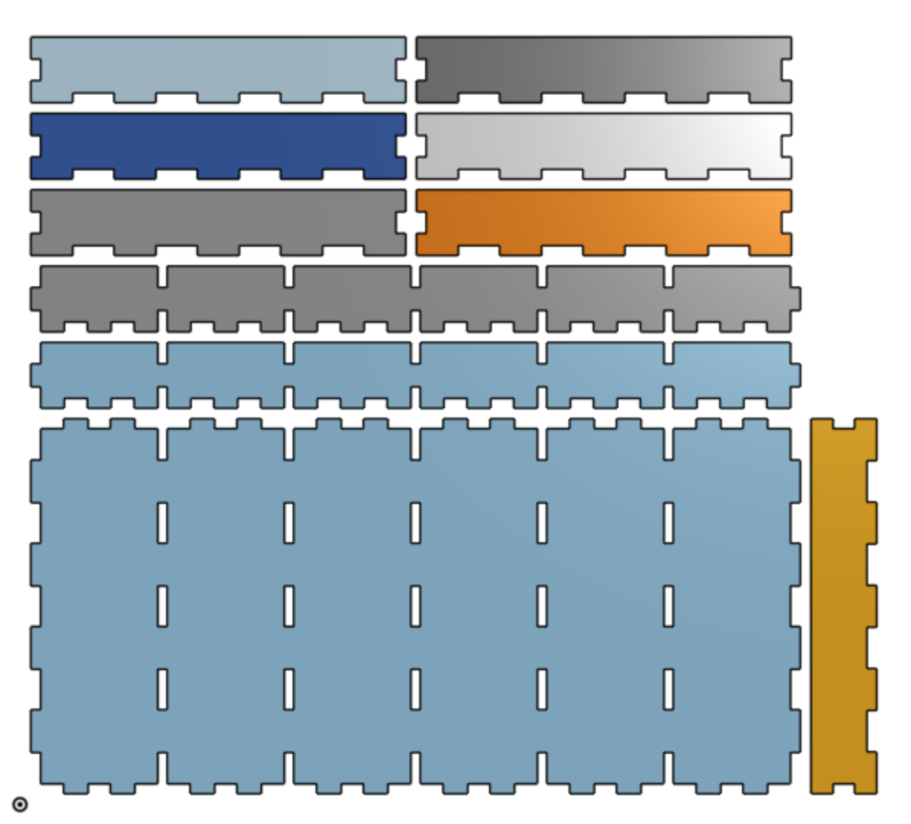

11. Create a drawing of the assembly 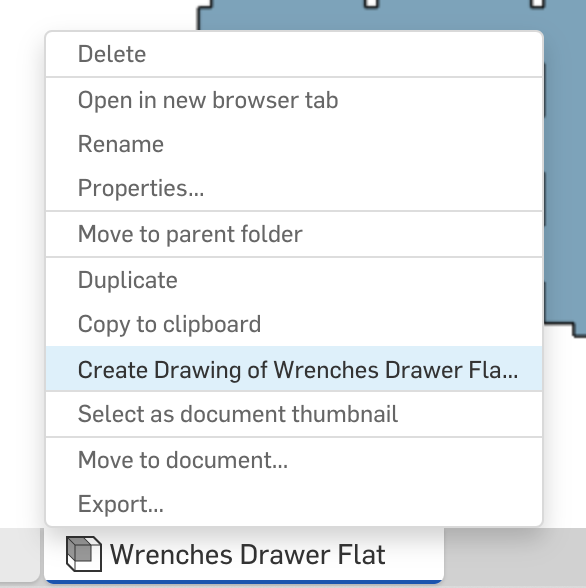
12. Choose custom layout 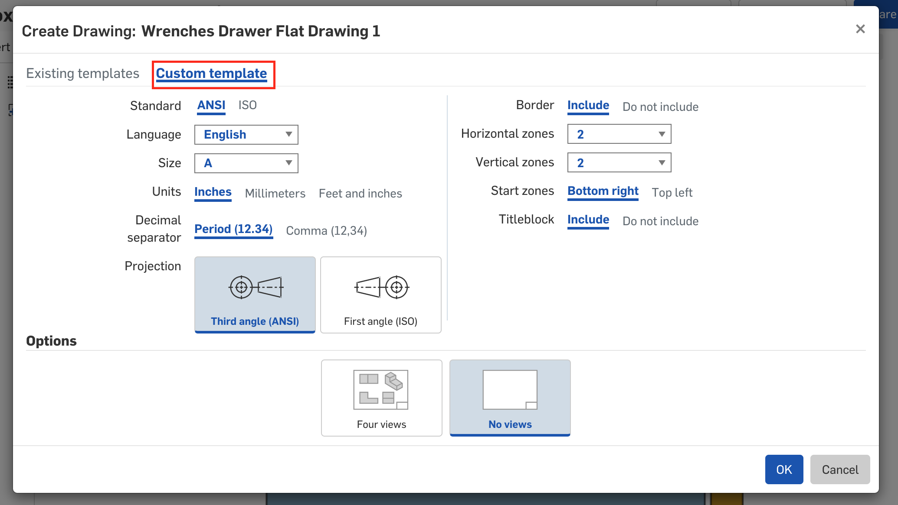
13. Do not include title or border 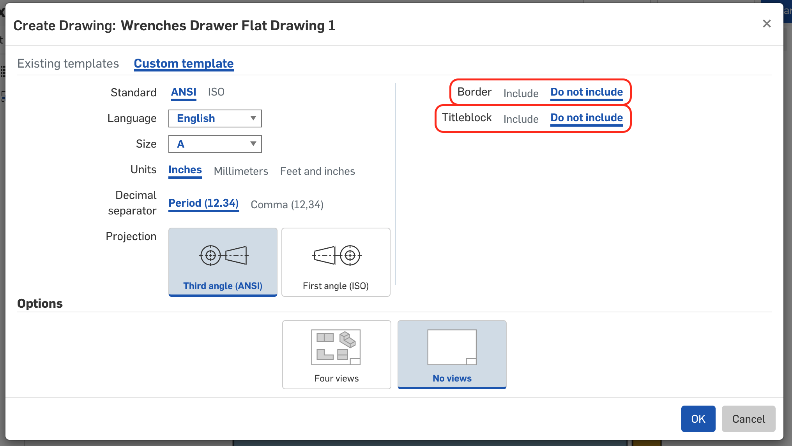
14. Be sure the scale is 1:1 or your parts won't be the correct size. 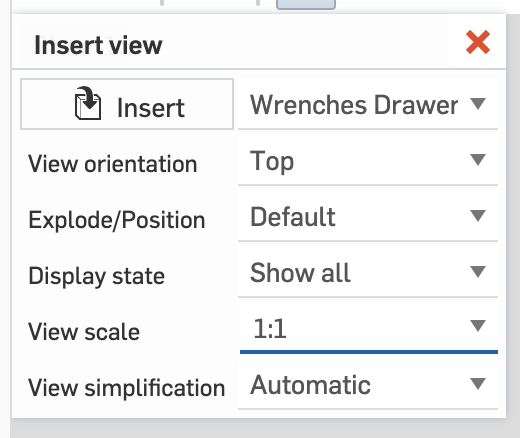
15. Depending on the size of what you are cutting, the paper might be undersized. 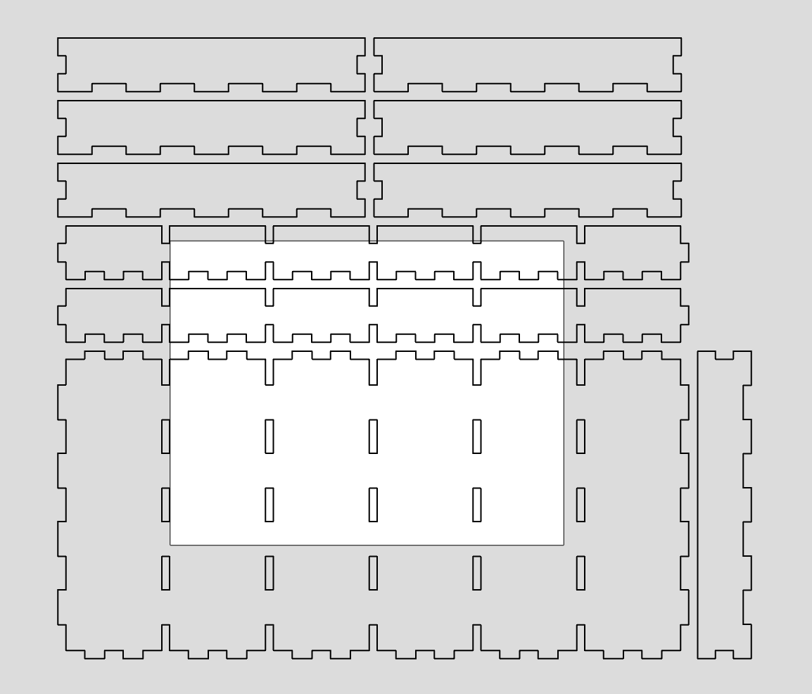
We need our sheet size to match the size of our stock material.

17. Open the sheets menu 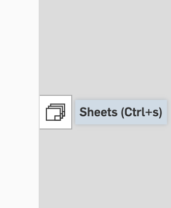
17. Open the properties of the sheet 
18. Choose **Custom** in the format drop down 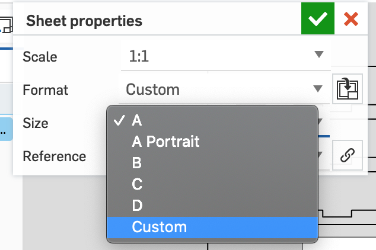
19. Set the sheet size to match your stock material. The max size for the Laser Cutter is 24" wide by 18" tall. 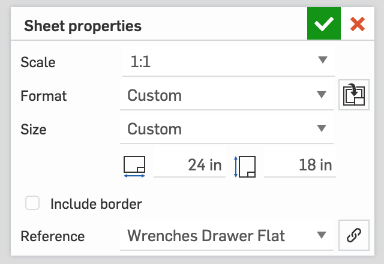
20. Be sure the parts are fully contained on the sheet 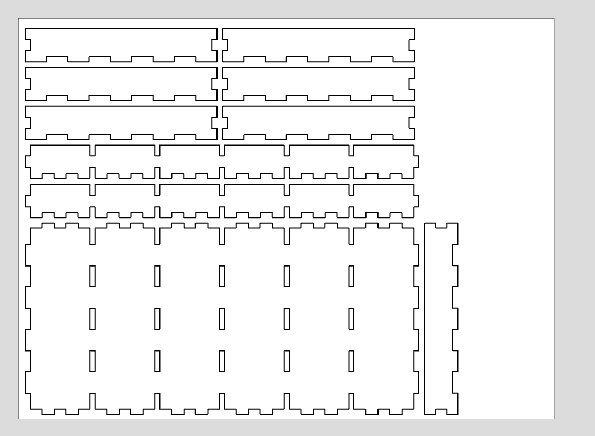
21. Export the drawing 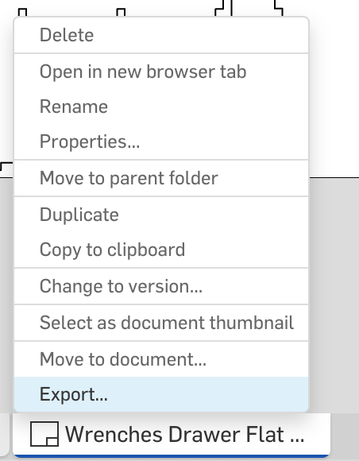
22. Be sure to select SVG as your output format 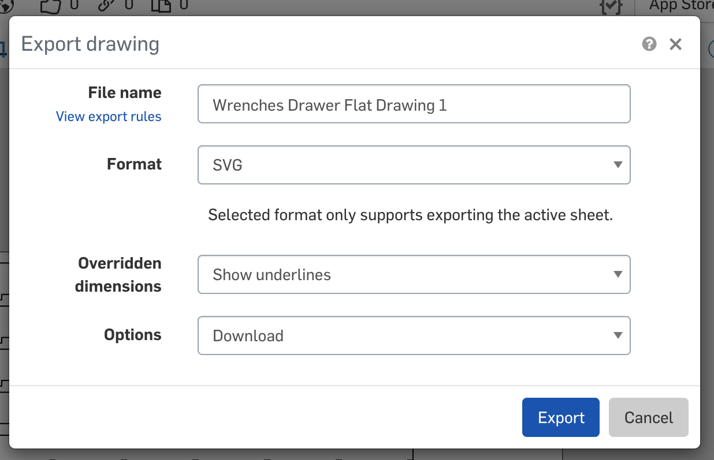

The SVG file can be cut with the laser cutter. The Laser Cutter Intro guide describes the cutting process in detail.

32. [Next Steps](guides/laser-cutter-intro/#preparing-the-file)