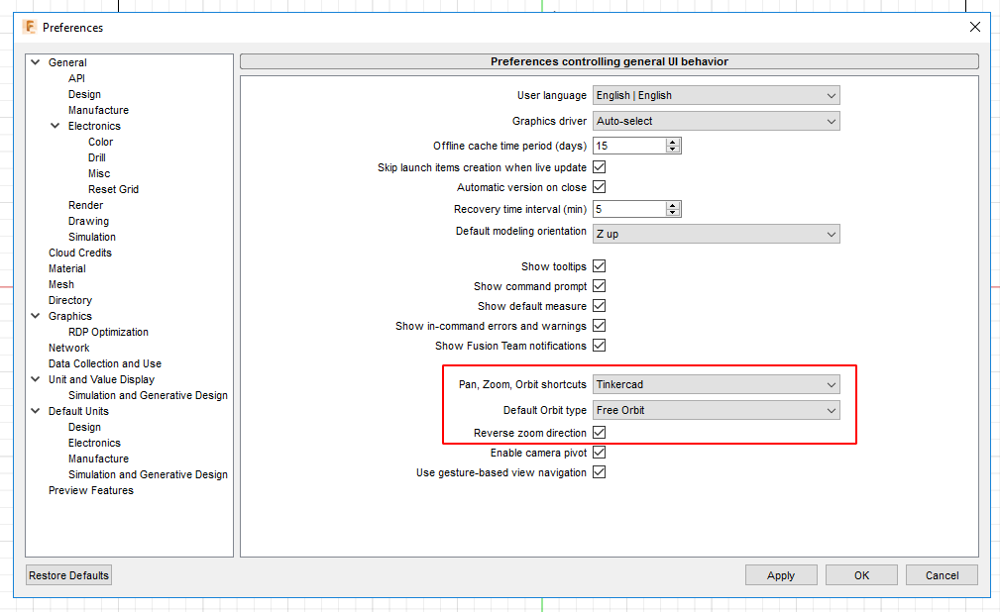
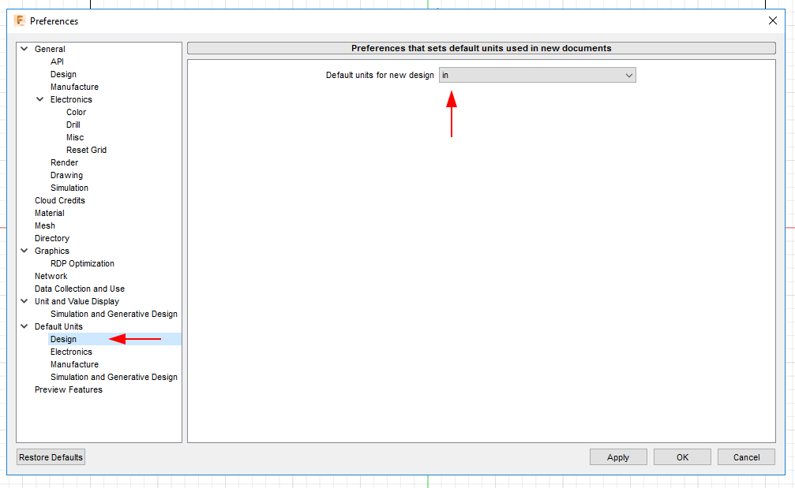
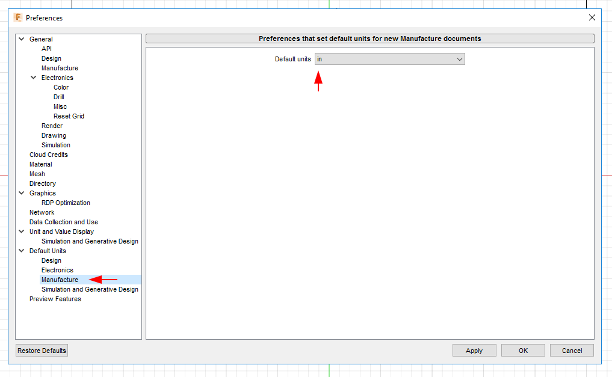

We often work in inches, having default units set to inches can be desirable.

To open the preferences, left-click your name in the top right corner of Fusion 360 and select Preferences.

To most closely match Onshape behavior

Design units apply when importing STEP files and preparing geometry.

Manufacturing units apply to when building gcode with CAM.
