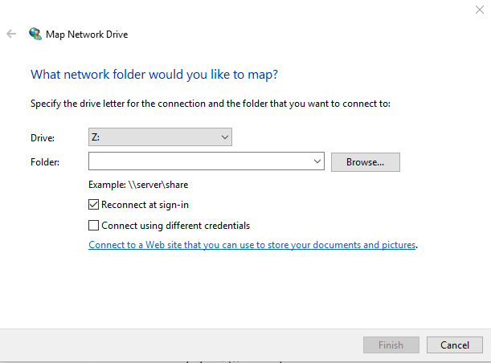

1. In Windows open File Explorer
2. Check in "This PC" for a "Z:" drive called "gcode", if it exists jump to step 9
3. Right click on "This PC"
4. Choose "Map Network Drive"
5. In the "Folder" field enter "\\\veloxrouter\gcode"
6. Click finish
7. When prompted for a username enter "cnc"
8. Password is the same as our computers
9. Now use your new folder to copy your .tap gcode file onto the Velox PC
